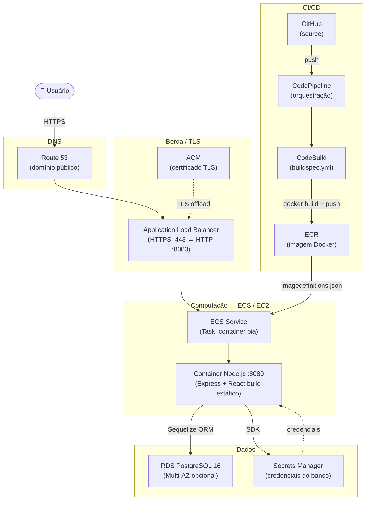
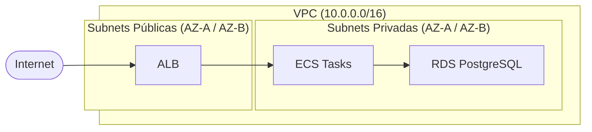
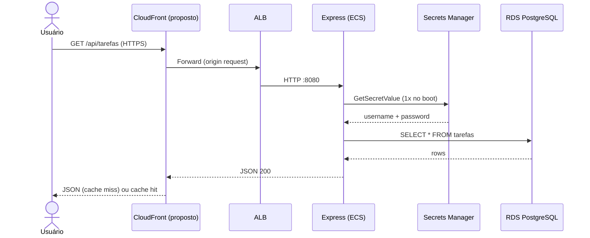
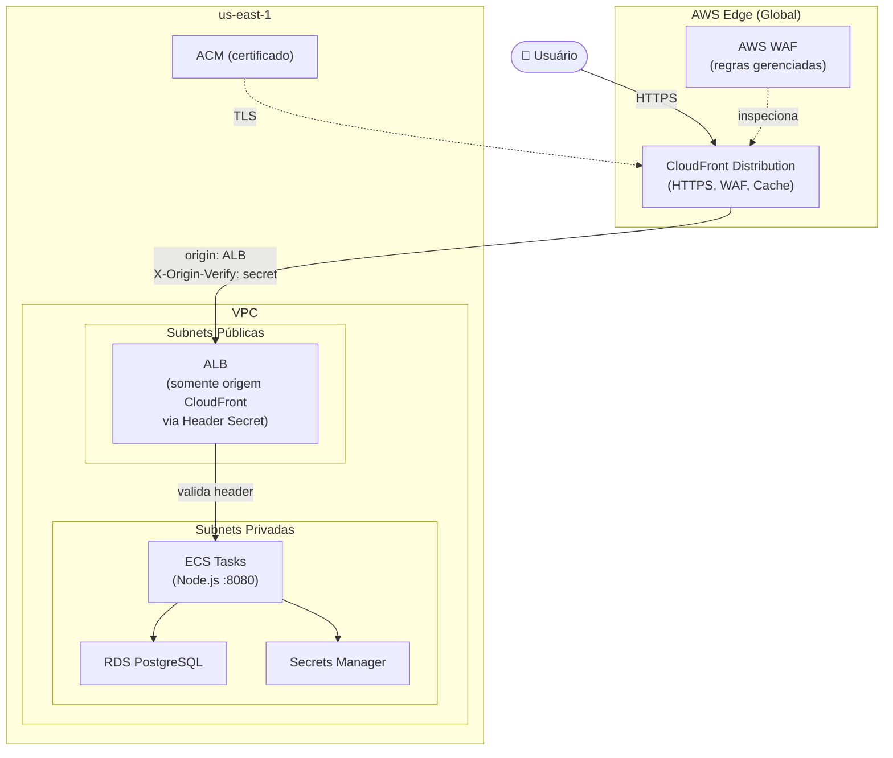

# Arquitetura de Serviço — BIA

> Documento gerado em: 26/03/2026

---

## 1. Visão Geral

O BIA é uma aplicação web fullstack de gerenciamento de tarefas (Task Tracker) construída com React no front-end e Node.js/Express no back-end, servida como uma aplicação monolítica containerizada no AWS ECS. O banco de dados é PostgreSQL gerenciado via AWS RDS, com credenciais protegidas pelo Secrets Manager.

---

## 2. Arquitetura Atual

### Diagrama — Fluxo de Requisição (Produção)



### Diagrama — Arquitetura de Rede (VPC)



---

## 3. Componentes e Responsabilidades

| Componente | Tecnologia | Responsabilidade |
|---|---|---|
| Front-End | React 18 + Vite | SPA servida como build estático pelo Express |
| Back-End | Node.js + Express 4 | API REST + serve os assets do React |
| ORM | Sequelize 6 | Abstração do banco, migrations |
| Banco de Dados | PostgreSQL 16 (RDS) | Persistência das tarefas |
| Secrets | AWS Secrets Manager | Credenciais do banco em produção |
| Container | Docker (node:22-slim) | Empacotamento da aplicação |
| Registry | ECR | Armazenamento das imagens Docker |
| Orquestração | ECS (EC2 launch type) | Execução e escalonamento dos containers |
| Balanceamento | ALB | Roteamento HTTPS, health checks |
| TLS | ACM | Certificado gerenciado |
| DNS | Route 53 | Resolução de domínio |
| CI/CD | CodePipeline + CodeBuild | Build e deploy automatizados |

---

## 4. Fluxo de Dados — Requisição de Tarefa



---

## 5. Pontos de Atenção na Arquitetura Atual

### 5.1 Acoplamento Front-End / Back-End
O React build estático é servido pelo próprio Express. Isso significa que qualquer deploy da API derruba momentaneamente o front-end. Além disso, o Express consome recursos de CPU/memória para servir arquivos estáticos, função que um CDN faz com custo zero de computação.

### 5.2 Exposição direta do ALB
O ALB está exposto diretamente à internet. Sem CloudFront na frente, não há proteção WAF nativa de borda, sem cache de assets estáticos e sem aceleração global.

### 5.3 CORS aberto
`app.use(cors())` sem restrição de origem permite requisições de qualquer domínio. Em produção, deve ser restrito ao domínio do CloudFront.

### 5.4 `rejectUnauthorized: false` no SSL do RDS
A conexão com o RDS usa `rejectUnauthorized: false`, o que desabilita a validação do certificado TLS. O correto é usar o bundle de CAs da AWS.

### 5.5 Sourcemaps expostos em produção
`vite.config.js` tem `sourcemap: true` no build. Isso expõe o código-fonte original no browser em produção.

### 5.6 Sem health check ativo no Compose
O `healthcheck` está comentado no Docker Compose, o que dificulta detecção de falhas em ambiente local.

---

## 6. Proposta: CloudFront na Frente da Aplicação

### Por que CloudFront?

- Assets estáticos do React (JS, CSS, imagens) servidos do edge com baixíssima latência
- TLS gerenciado no edge, sem custo adicional de ACM
- WAF integrado para proteção contra ataques comuns (SQLi, XSS, rate limiting)
- O ALB pode ser restrito a aceitar tráfego **somente do CloudFront**, removendo exposição direta à internet
- Cache configurável por path: assets estáticos com TTL longo, API com TTL zero

### Diagrama — Arquitetura com CloudFront



### Comportamentos de Cache (Cache Behaviors)

| Path Pattern | TTL | Descrição |
|---|---|---|
| `/assets/*` | 1 ano (31536000s) | JS/CSS com hash no nome (Vite) |
| `*.ico`, `*.png`, `*.svg` | 7 dias | Imagens estáticas |
| `/api/*` | 0 (no-cache) | API REST — nunca cachear |
| `/*` (default) | 0 | index.html — sem cache para garantir SPA routing |

---

## 7. Alterações Necessárias no Projeto

### 7.1 Restringir CORS ao domínio do CloudFront

**Arquivo:** `config/express.js`

```js
// Antes
app.use(cors());

// Depois
const allowedOrigins = process.env.ALLOWED_ORIGINS
  ? process.env.ALLOWED_ORIGINS.split(',')
  : ['http://localhost:3001'];

app.use(cors({
  origin: allowedOrigins,
  methods: ['GET', 'POST', 'PUT', 'DELETE'],
  credentials: true,
}));
```

Adicionar a variável de ambiente `ALLOWED_ORIGINS=https://seu-dominio.com` na task definition do ECS.

### 7.2 Validar o header secreto do CloudFront no ALB

No ALB, criar uma **Listener Rule** que rejeita (retorna 403) qualquer requisição que não contenha o header `X-Origin-Verify` com o valor correto. O valor do header é armazenado no Secrets Manager e configurado no CloudFront como **Custom Origin Header**.

Isso garante que o ALB só aceite tráfego vindo do CloudFront, mesmo que o DNS do ALB seja descoberto.

### 7.3 Corrigir SSL do RDS

**Arquivo:** `config/database.js`

```js
// Antes
ssl: {
  require: true,
  rejectUnauthorized: false,
}

// Depois
const fs = require('fs');
ssl: {
  require: true,
  rejectUnauthorized: true,
  ca: fs.readFileSync('/usr/src/app/certs/aws-rds-ca.pem').toString(),
}
```

Baixar o bundle de CAs da AWS: https://truststore.pki.rds.amazonaws.com/global/global-bundle.pem  
Adicionar o arquivo `certs/aws-rds-ca.pem` ao projeto e ao `COPY` do Dockerfile.

### 7.4 Desabilitar sourcemaps em produção

**Arquivo:** `client/vite.config.js`

```js
build: {
  outDir: 'build',
  sourcemap: false, // era true
},
```

### 7.5 Variável de ambiente `VITE_API_URL` no build do CloudFront

Com CloudFront, o front-end e a API ficam no mesmo domínio. O `VITE_API_URL` pode ser uma path relativa:

**Dockerfile:**
```dockerfile
ARG VITE_API_URL=/
ENV VITE_API_URL=${VITE_API_URL}
```

Isso elimina a necessidade de hardcodar a URL da API no build.

### 7.6 Adicionar variável de ambiente na Task Definition

```json
{
  "name": "ALLOWED_ORIGINS",
  "value": "https://seu-dominio.com"
}
```

---

## 8. Configuração do CloudFront (Resumo AWS Console / CLI)

### Passo 1 — Criar a Distribution

```bash
aws cloudfront create-distribution --distribution-config file://cloudfront-config.json
```

### cloudfront-config.json (estrutura essencial)

```json
{
  "Origins": {
    "Items": [{
      "Id": "bia-alb-origin",
      "DomainName": "seu-alb.us-east-1.elb.amazonaws.com",
      "CustomOriginConfig": {
        "HTTPSPort": 443,
        "OriginProtocolPolicy": "https-only"
      },
      "CustomHeaders": {
        "Items": [{
          "HeaderName": "X-Origin-Verify",
          "HeaderValue": "SEU_SEGREDO_AQUI"
        }]
      }
    }]
  },
  "DefaultCacheBehavior": {
    "TargetOriginId": "bia-alb-origin",
    "ViewerProtocolPolicy": "redirect-to-https",
    "CachePolicyId": "4135ea2d-6df8-44a3-9df3-4b5a84be39ad",
    "AllowedMethods": { "Items": ["GET","HEAD","OPTIONS","PUT","POST","PATCH","DELETE"] }
  },
  "CacheBehaviors": {
    "Items": [
      {
        "PathPattern": "/assets/*",
        "TargetOriginId": "bia-alb-origin",
        "ViewerProtocolPolicy": "redirect-to-https",
        "DefaultTTL": 31536000,
        "MaxTTL": 31536000
      },
      {
        "PathPattern": "/api/*",
        "TargetOriginId": "bia-alb-origin",
        "ViewerProtocolPolicy": "redirect-to-https",
        "DefaultTTL": 0,
        "MaxTTL": 0,
        "AllowedMethods": { "Items": ["GET","HEAD","OPTIONS","PUT","POST","PATCH","DELETE"] }
      }
    ]
  },
  "ViewerCertificate": {
    "ACMCertificateArn": "arn:aws:acm:us-east-1:ACCOUNT_ID:certificate/SEU_CERT",
    "SslSupportMethod": "sni-only",
    "MinimumProtocolVersion": "TLSv1.2_2021"
  },
  "WebACLId": "arn:aws:wafv2:us-east-1:ACCOUNT_ID:global/webacl/bia-waf/ID"
}
```

### Passo 2 — Associar WAF

```bash
aws wafv2 create-web-acl \
  --name bia-waf \
  --scope CLOUDFRONT \
  --region us-east-1 \
  --default-action Allow={} \
  --rules file://waf-rules.json \
  --visibility-config SampledRequestsEnabled=true,CloudWatchMetricsEnabled=true,MetricName=bia-waf
```

Regras recomendadas (managed rule groups):
- `AWSManagedRulesCommonRuleSet` — proteção geral (SQLi, XSS)
- `AWSManagedRulesKnownBadInputsRuleSet` — inputs maliciosos conhecidos
- Rate-based rule: máximo 1000 req/5min por IP

### Passo 3 — Restringir o Security Group do ALB

```bash
# Remover regra de acesso público
aws ec2 revoke-security-group-ingress \
  --group-id sg-ALB_ID \
  --protocol tcp --port 443 --cidr 0.0.0.0/0

# Adicionar apenas prefixos do CloudFront
aws ec2 authorize-security-group-ingress \
  --group-id sg-ALB_ID \
  --ip-permissions file://cloudfront-prefix-list.json
```

> O Managed Prefix List do CloudFront tem o ID `pl-3b927c52` na região us-east-1. Use-o diretamente no Security Group para manutenção automática da lista de IPs.

---

## 9. Resumo das Melhorias Priorizadas

| Prioridade | Melhoria | Impacto |
|---|---|---|
| 🔴 Alta | Adicionar CloudFront + WAF | Segurança, performance, CDN |
| 🔴 Alta | Restringir ALB ao CloudFront (header secret + prefix list) | Elimina exposição direta |
| 🔴 Alta | Corrigir `rejectUnauthorized: false` no RDS | Segurança TLS |
| 🟡 Média | Restringir CORS ao domínio do CloudFront | Segurança da API |
| 🟡 Média | Desabilitar sourcemaps em produção | Proteção do código-fonte |
| 🟢 Baixa | Separar front-end (S3 + CloudFront) do back-end (ECS) | Escalabilidade independente |
| 🟢 Baixa | Ativar healthcheck no Docker Compose | Observabilidade local |
| 🟢 Baixa | Adicionar CloudWatch Alarms (CPU, erros 5xx, latência) | Observabilidade em produção |
