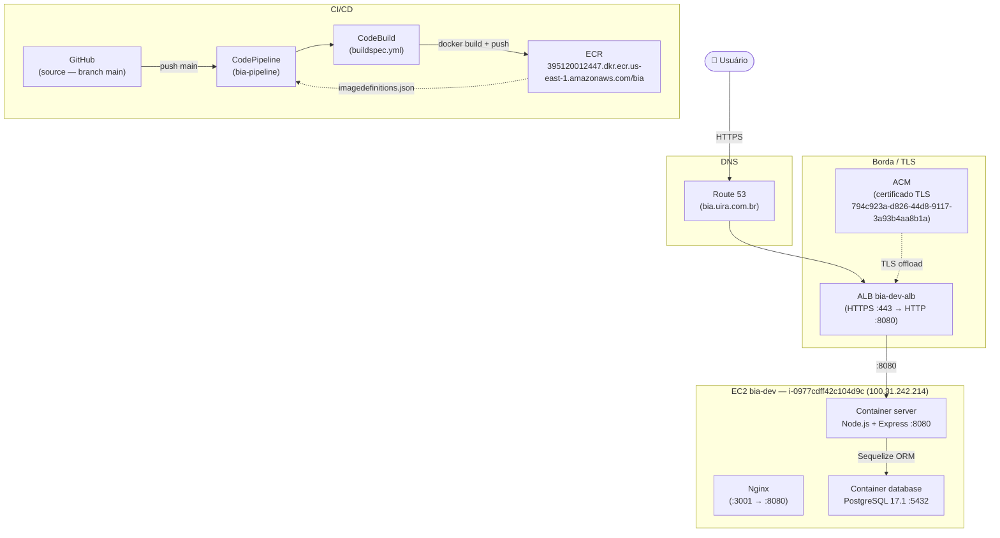
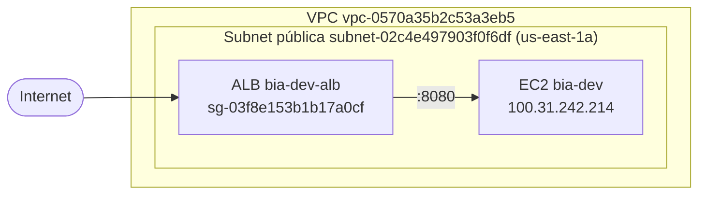
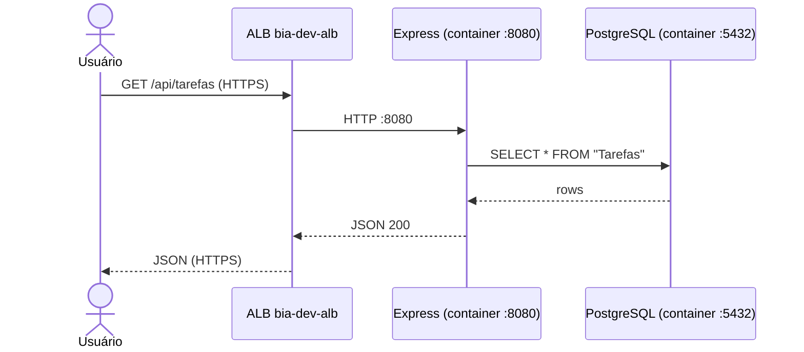
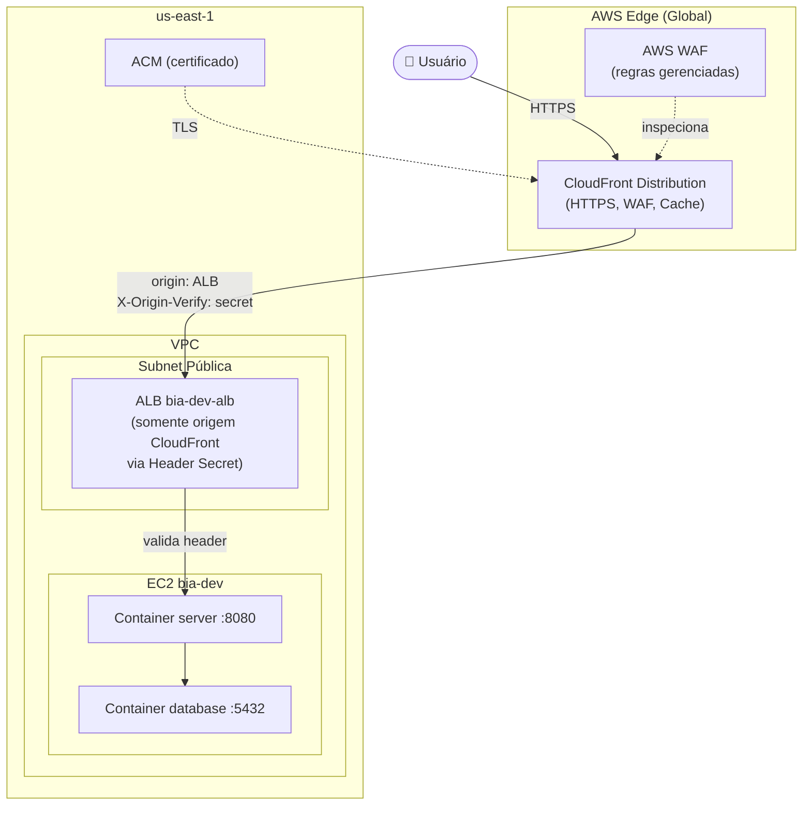

# Arquitetura de Serviço — BIA

> Atualizado em: 30/03/2026

---

## 1. Visão Geral

O BIA é uma aplicação web fullstack de gerenciamento de tarefas (Task Tracker) construída com React no front-end e Node.js/Express no back-end, servida como uma aplicação monolítica containerizada. Em produção, roda em uma instância EC2 via Docker Compose, com banco PostgreSQL em container no mesmo host. O acesso público é feito via ALB com HTTPS, certificado ACM e domínio `bia.uira.com.br` gerenciado no Route 53.

---

## 2. Arquitetura Atual

### Diagrama — Fluxo de Requisição (Produção)

### Diagrama — Arquitetura de Rede

---

## 3. Componentes e Responsabilidades

| Componente | Tecnologia | Responsabilidade |
|---|---|---|
| Front-End | React 18 + Vite | SPA servida como build estático pelo Express |
| Back-End | Node.js + Express 4 | API REST + serve os assets do React |
| ORM | Sequelize 6 | Abstração do banco, migrations |
| Banco de Dados | PostgreSQL 17.1 (container) | Persistência das tarefas no mesmo host EC2 |
| Proxy Reverso | Nginx | Roteamento da porta 3001 para :8080 |
| Container | Docker (node:22-slim) | Empacotamento da aplicação |
| Registry | ECR `395120012447.dkr.ecr.us-east-1.amazonaws.com/bia` | Armazenamento das imagens Docker |
| Balanceamento | ALB `bia-dev-alb` | Roteamento HTTPS, health checks |
| TLS | ACM `794c923a-d826-44d8-9117-3a93b4aa8b1a` | Certificado gerenciado para `bia.uira.com.br` |
| DNS | Route 53 hosted zone `uira.com.br` | Resolução de domínio |
| CI/CD | CodePipeline + CodeBuild | Build e deploy automatizados |

---

## 4. Fluxo de Dados — Requisição de Tarefa

---

## 5. Fluxo de Deploy (CI/CD)

```mermaid
sequenceDiagram
    actor DEV as Desenvolvedor
    participant GH as GitHub (branch main)
    participant CP as CodePipeline bia-pipeline
    participant CB as CodeBuild bia-build
    participant ECR as ECR (bia)
    participant EC2 as EC2 bia-dev

    DEV->>GH: git push main
    GH->>CP: trigger source stage
    CP->>CB: stage build (buildspec.yml)

    rect rgb(40, 40, 60)
        Note over CB: pre_build
        CB->>ECR: ecr get-login-password (autenticação)
    end

    rect rgb(40, 60, 40)
        Note over CB: build
        CB->>CB: docker build -t bia:latest
    end

    rect rgb(60, 40, 40)
        Note over CB: post_build
        CB->>ECR: docker push bia:latest + bia:COMMIT_HASH
        CB->>CB: gera imagedefinitions.json
    end

    CP->>EC2: stage deploy (ECS rolling update)
```

---

## 6. Recursos AWS Provisionados

| Recurso | ID / Valor |
|---|---|
| EC2 Instance | `i-0977cdff42c104d9c` — `bia-dev` |
| IP Público EC2 | `100.31.242.214` |
| Security Group | `sg-03f8e153b1b17a0cf` — `bia-alb-sg` |
| VPC | `vpc-0570a35b2c53a3eb5` |
| Subnet | `subnet-02c4e497903f0f6df` (us-east-1a) |
| ECR Repository | `395120012447.dkr.ecr.us-east-1.amazonaws.com/bia` |
| ALB | `bia-dev-alb` |
| Target Group | `bia-alb-sg` — porta `8080` — health check `/api/versao` |
| Certificado ACM | `794c923a-d826-44d8-9117-3a93b4aa8b1a` — domínio `bia.uira.com.br` |
| Hosted Zone | `uira.com.br` |
| Conta AWS | `395120012447` — região `us-east-1` |

---

## 7. Pontos de Atenção na Arquitetura Atual

### 7.1 Banco de dados no mesmo host
O PostgreSQL roda em container no mesmo EC2 da aplicação. Sem isolamento, um problema no host derruba tanto a app quanto o banco. Para produção com maior disponibilidade, migrar para RDS.

### 7.2 Sem persistência de dados garantida em redeploy
O volume do PostgreSQL (`postgres-data`) depende do Docker Compose. Se a instância for substituída ou o volume removido (`docker-compose down -v`), os dados são perdidos.

### 7.3 Exposição direta do ALB
O ALB está exposto diretamente à internet. Sem CloudFront na frente, não há cache de assets estáticos nem proteção WAF de borda.

### 7.4 CORS aberto
`app.use(cors())` sem restrição de origem permite requisições de qualquer domínio. Em produção, deve ser restrito ao domínio da aplicação.

### 7.5 `rejectUnauthorized: false` no SSL
A configuração atual desabilita validação de certificado TLS na conexão com o banco. Aceitável para banco em container local, mas deve ser corrigido ao migrar para RDS.

### 7.6 Sourcemaps expostos em produção
`vite.config.js` tem `sourcemap: true` no build, expondo o código-fonte original no browser.

---

## 8. Proposta: CloudFront na Frente da Aplicação

### Por que CloudFront?

- Assets estáticos do React (JS, CSS, imagens) servidos do edge com baixíssima latência
- TLS gerenciado no edge, sem custo adicional
- WAF integrado para proteção contra ataques comuns (SQLi, XSS, rate limiting)
- O ALB pode ser restrito a aceitar tráfego **somente do CloudFront**, removendo exposição direta à internet
- Cache configurável por path: assets estáticos com TTL longo, API com TTL zero

### Diagrama — Arquitetura com CloudFront

### Comportamentos de Cache (Cache Behaviors)

| Path Pattern | TTL | Descrição |
|---|---|---|
| `/assets/*` | 1 ano (31536000s) | JS/CSS com hash no nome (Vite) |
| `*.ico`, `*.png`, `*.svg` | 7 dias | Imagens estáticas |
| `/api/*` | 0 (no-cache) | API REST — nunca cachear |
| `/*` (default) | 0 | index.html — sem cache para SPA routing |

---

## 9. Resumo das Melhorias Priorizadas

| Prioridade | Melhoria | Impacto |
|---|---|---|
| 🔴 Alta | Migrar banco para RDS | Dados persistentes, backup automático, isolamento |
| 🔴 Alta | Adicionar CloudFront + WAF | Segurança, performance, CDN |
| 🔴 Alta | Restringir ALB ao CloudFront (header secret) | Elimina exposição direta |
| 🟡 Média | Restringir CORS ao domínio da aplicação | Segurança da API |
| 🟡 Média | Desabilitar sourcemaps em produção | Proteção do código-fonte |
| 🟡 Média | Secrets Manager para credenciais do banco | Segurança das credenciais |
| 🟢 Baixa | Separar front-end (S3 + CloudFront) do back-end | Escalabilidade independente |
| 🟢 Baixa | Adicionar CloudWatch Alarms (CPU, erros 5xx, latência) | Observabilidade em produção |
