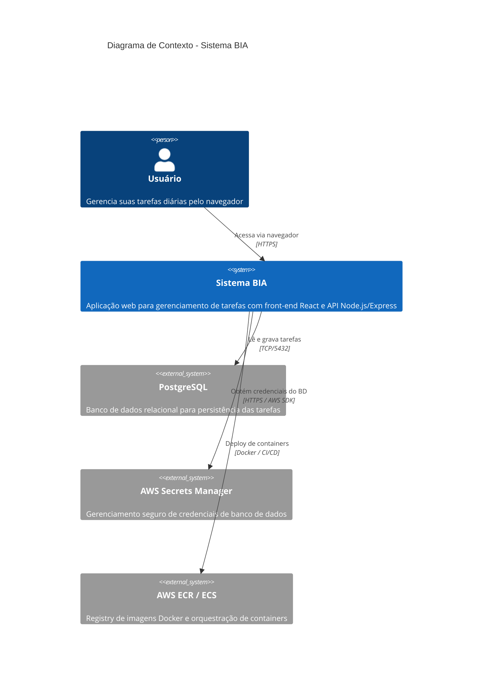
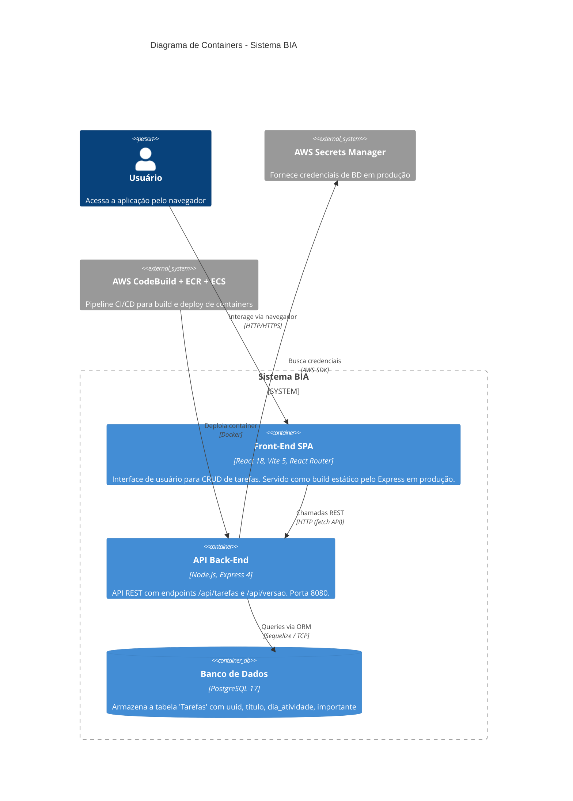
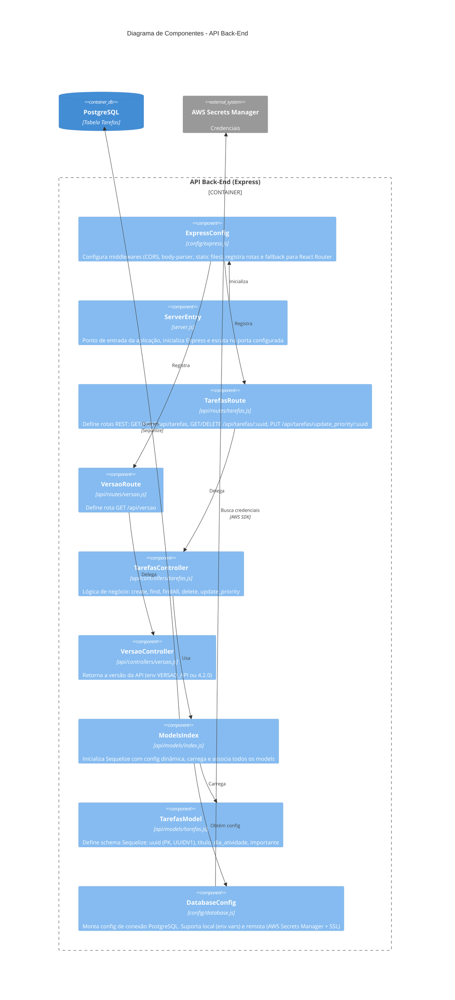
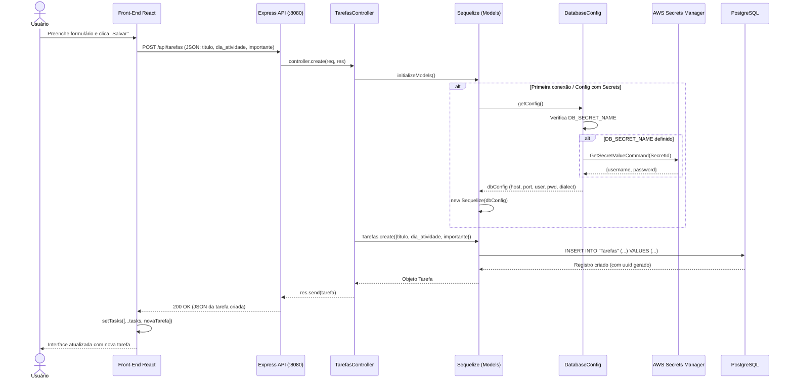

# 🏗️ Documentação Arquitetural — Projeto BIA

> **Versão:** 4.2.0  
> **Data:** 21/03/2026  
> **Gerado automaticamente** a partir de análise estática do código-fonte.

---

## Índice

1. [Visão Geral](#visão-geral)
2. [Stack Tecnológica](#stack-tecnológica)
3. [Diagramas C4](#diagramas-c4)
   - [Nível 1 — Contexto do Sistema](#nível-1--contexto-do-sistema)
   - [Nível 2 — Containers](#nível-2--containers)
   - [Nível 3 — Componentes do Back-End](#nível-3--componentes-do-back-end)
4. [Diagramas de Fluxo](#diagramas-de-fluxo)
   - [Fluxo de Requisição Típica](#fluxo-de-requisição-típica)
   - [Fluxo de Deploy (CI/CD)](#fluxo-de-deploy-cicd)
5. [Estrutura de Diretórios](#estrutura-de-diretórios)
6. [Resumo Arquitetural](#resumo-arquitetural)
7. [Pontos de Melhoria Estrutural](#pontos-de-melhoria-estrutural)

---

## Visão Geral

O **BIA** é uma aplicação web de gerenciamento de tarefas (_task tracker_) composta por duas camadas principais:

| Camada | Tecnologia | Responsabilidade |
|---|---|---|
| **Front-End** | React 18 + Vite 5 | Interface de usuário SPA para criação, listagem, exclusão e alteração de prioridade de tarefas |
| **Back-End (API)** | Node.js + Express 4 | API REST que expõe endpoints `/api/*` para operações CRUD de tarefas e informações de versão |
| **Persistência** | PostgreSQL 17 + Sequelize 6 | Banco de dados relacional acessado via ORM Sequelize |
| **Infraestrutura** | Docker, AWS ECR, AWS ECS, AWS CodeBuild | Containerização e pipeline de CI/CD |
| **Segredos** | AWS Secrets Manager | Gerenciamento de credenciais de banco de dados em ambientes de produção |

---

## Stack Tecnológica

### Front-End (`client/`)

| Tecnologia | Versão | Finalidade |
|---|---|---|
| React | ^18.3.1 | Biblioteca de UI (SPA) |
| React Router DOM | ^6.28.0 | Roteamento client-side |
| React Icons | ^5.3.0 | Ícones visuais |
| Vite | ^5.4.19 | Bundler e servidor de desenvolvimento |
| json-server | ^1.0.0-beta.3 | Mock de API para desenvolvimento isolado |

### Back-End (raiz)

| Tecnologia | Versão | Finalidade |
|---|---|---|
| Express | ^4.17.1 | Framework web / API REST |
| Sequelize | ^6.6.5 | ORM para PostgreSQL |
| pg / pg-hstore | ^8.7.1 / ^2.3.4 | Driver PostgreSQL |
| cors | ^2.8.5 | Middleware CORS |
| morgan | ^1.10.0 | Logger HTTP |
| @aws-sdk/client-secrets-manager | ^3.583.0 | Acesso ao AWS Secrets Manager |
| @aws-sdk/client-sts | ^3.583.0 | Validação de identidade AWS (debug) |
| config | ^4.1.1 | Configurações por ambiente |
| sequelize-cli | ^6.2.0 | Migrations do banco de dados |
| jest | ^27.5.1 | Testes unitários |

### Infraestrutura

| Recurso | Detalhes |
|---|---|
| Docker | `Dockerfile` multi-stage: instala deps, builda React, serve tudo via Express na porta 8080 |
| Docker Compose | Serviços `server` (app) e `database` (PostgreSQL 17.1) |
| AWS CodeBuild | `buildspec.yml` — build Docker, push para ECR, gera `imagedefinitions.json` para ECS |
| AWS ECR | Registro de imagem Docker |
| AWS ECS | Orquestração de containers |

---

## Diagramas C4

### Nível 1 — Contexto do Sistema

Visão de alto nível mostrando o usuário, o sistema BIA e seus serviços externos.



### Nível 2 — Containers

Detalhamento dos containers da aplicação e como se comunicam.



### Nível 3 — Componentes do Back-End

Estrutura interna da API, mostrando a separação de responsabilidades.



---

## Diagramas de Fluxo

### Fluxo de Requisição Típica

Exemplo: o usuário cria uma nova tarefa.



### Fluxo de Deploy (CI/CD)

Pipeline de build e deploy via AWS CodeBuild, ECR e ECS.

```mermaid
sequenceDiagram
    actor DEV as Desenvolvedor
    participant GIT as Repositório Git
    participant CB as AWS CodeBuild
    participant ECR as AWS ECR
    participant ECS as AWS ECS

    DEV->>GIT: git push (código atualizado)
    GIT->>CB: Trigger do pipeline (buildspec.yml)

    rect rgb(40, 40, 60)
        Note over CB: Fase pre_build
        CB->>ECR: aws ecr get-login-password (autenticação)
        ECR-->>CB: Login OK
    end

    rect rgb(40, 60, 40)
        Note over CB: Fase build
        CB->>CB: docker build -t bia:latest
        Note over CB: 1. Instala deps Node.js (raiz + client)
        Note over CB: 2. Vite build do React (client/build)
        Note over CB: 3. Prune devDependencies
    end

    rect rgb(60, 40, 40)
        Note over CB: Fase post_build
        CB->>ECR: docker push bia:latest + bia:COMMIT_HASH
        CB->>CB: Gera imagedefinitions.json
    end

    CB->>ECS: Atualiza task definition com nova imagem
    ECS->>ECS: Executa container na porta 8080
```



---

## Estrutura de Diretórios

```
bia/
├── api/                          # Camada da API REST
│   ├── controllers/
│   │   ├── tarefas.js            # CRUD de tarefas (create, find, findAll, delete, update_priority)
│   │   └── versao.js             # Retorna versão da API
│   ├── data/
│   │   └── tarefas.json          # Dados estáticos de exemplo
│   ├── models/
│   │   ├── index.js              # Inicializador Sequelize (carrega models dinamicamente)
│   │   └── tarefas.js            # Model Sequelize da tabela Tarefas
│   └── routes/
│       ├── ping.js               # Health check simples (GET /api/ping)
│       ├── tarefas.js            # Rotas REST para tarefas
│       └── versao.js             # Rota GET /api/versao
│
├── client/                       # Front-End React (SPA)
│   ├── src/
│   │   ├── App.jsx               # Componente raiz — lógica de fetch, CRUD, roteamento
│   │   ├── main.jsx              # Entry point React + ReactDOM
│   │   ├── index.css             # Estilos globais
│   │   ├── contexts/
│   │   │   ├── ThemeContext.jsx   # Context API para tema (dark/light)
│   │   │   └── LogContext.jsx    # Context API para logging de debug
│   │   └── components/
│   │       ├── Header.jsx        # Cabeçalho da aplicação
│   │       ├── Footer.jsx        # Rodapé
│   │       ├── Tasks.jsx         # Lista de tarefas
│   │       ├── Task.jsx          # Item individual de tarefa
│   │       ├── AddTask.jsx       # Formulário de adição de tarefa
│   │       ├── Button.jsx        # Componente de botão reutilizável
│   │       ├── About.jsx         # Página "Sobre"
│   │       ├── Modal.jsx         # Componente de modal genérico
│   │       ├── DebugLogs.jsx     # Painel de logs de debug
│   │       ├── VersionInfo.jsx   # Indicador de versão/status da API
│   │       └── DadosHenrylle.jsx # Informações do instrutor
│   ├── vite.config.js            # Configuração Vite (porta 3001, build > build/)
│   ├── db.json                   # Dados mock para json-server
│   └── package.json
│
├── config/
│   ├── database.js               # Config de conexão PostgreSQL (local + AWS Secrets Manager)
│   ├── express.js                # Config do Express (middlewares, rotas, static files)
│   └── default.json              # Config padrão (porta 8080)
│
├── database/
│   └── migrations/
│       └── 20210924...-criar-tarefas.js  # Migration: cria tabela Tarefas
│
├── lib/
│   └── boot.js                   # Auto-loader de controllers (app/ — legado, usado por index.js)
│
├── scripts/                      # Scripts auxiliares
├── tests/                        # Testes unitários (Jest)
│
├── server.js                     # ✅ Entry point principal (usa config/express.js)
├── index.js                      # ⚠️  Entry point legado (usa lib/boot.js — NÃO usado em produção)
├── Dockerfile                    # Build multi-step: Node 22, npm install, vite build, CMD npm start
├── Dockerfile_checkdisponibilidade  # Utilitário: container Alpine para checar disponibilidade via curl
├── compose.yml                   # Docker Compose: serviços server + database (PostgreSQL 17.1)
├── buildspec.yml                 # AWS CodeBuild: build Docker, push ECR, gera imagedefinitions.json
├── .sequelizerc                  # Configuração do Sequelize CLI (paths de migrations/models)
└── package.json                  # Dependências do back-end
```

---

## Resumo Arquitetural

### Principais Responsabilidades

| Aplicação | Responsabilidades |
|---|---|
| **Front-End (React SPA)** | Renderização da interface de gerenciamento de tarefas, roteamento client-side (`/` e `/about`), chamadas REST à API, gerenciamento de estado local com `useState`, contextos para tema e logging de debug, verificação periódica de saúde da API (`VersionInfo`). |
| **Back-End (Express API)** | Exposição de endpoints REST (`/api/tarefas`, `/api/versao`), orquestração de operações CRUD via controllers, inicialização dinâmica de models Sequelize, resolução de credenciais de banco via variáveis de ambiente ou AWS Secrets Manager, servir o build estático do React em produção. |
| **Banco de Dados (PostgreSQL)** | Persistência da tabela `Tarefas` com campos `uuid`, `titulo`, `dia_atividade`, `importante`, `createdAt`, `updatedAt`. Migrations gerenciadas via Sequelize CLI. |

### Como as Aplicações se Comunicam

1. **Usuário ↔ Front-End:** O usuário acessa a SPA React via navegador. Em produção, o front-end é servido como arquivos estáticos pelo próprio Express (via `express.static` apontando para `client/build`).

2. **Front-End ↔ Back-End:** A comunicação acontece via **Fetch API** nativa do navegador, com chamadas REST ao endpoint base configurável (`VITE_API_URL` ou `http://localhost:8080`). Os métodos HTTP utilizados são:
   - `GET /api/tarefas` — listar todas as tarefas
   - `GET /api/tarefas/:uuid` — buscar tarefa específica
   - `POST /api/tarefas` — criar nova tarefa
   - `PUT /api/tarefas/update_priority/:uuid` — alternar prioridade
   - `DELETE /api/tarefas/:uuid` — remover tarefa
   - `GET /api/versao` — obter versão da API

3. **Back-End ↔ Banco:** O acesso é feito via **Sequelize ORM**. A configuração de conexão é resolvida dinamicamente em `config/database.js`, que suporta dois modos:
   - **Local:** variáveis de ambiente `DB_HOST`, `DB_USER`, `DB_PWD`, `DB_PORT`
   - **Produção (AWS):** credenciais obtidas do **AWS Secrets Manager** via `DB_SECRET_NAME`, com suporte a SSL

### Principais Decisões Arquiteturais Observadas

| Decisão | Descrição |
|---|---|
| **Monorepo** | Front-end e back-end no mesmo repositório, facilitando build unificado via Docker |
| **SPA servida pelo Express** | Em produção, o Express serve os assets estáticos do React e usa fallback para `index.html` (suportando React Router) |
| **ORM com Sequelize** | Abstração de banco de dados que permite migrations versionadas e troca de dialeto |
| **AWS Secrets Manager** | Credenciais de banco não ficam em código — são recuperadas em runtime via SDK |
| **Fetch API** | Comunicação Front→API usa `fetch` nativo, sem bibliotecas adicionais como Axios |
| **Context API para estado global** | Tema (dark/light) e logs de debug gerenciados via React Context ao invés de Redux |
| **Vite como bundler** | Substituiu Create React App, oferecendo build mais rápido e HMR eficiente |
| **Docker Compose para dev local** | Ambiente reproduzível com app + PostgreSQL em containers |
| **CI/CD com CodeBuild** | Pipeline automatizado: build Docker → push ECR → deploy ECS |

---

## Pontos de Melhoria Estrutural

### 🔴 Críticos

| # | Ponto | Descrição |
|---|---|---|
| 1 | **Ausência de autenticação** | Todos os endpoints da API são públicos. Qualquer usuário pode criar, deletar e modificar tarefas sem autenticação. Recomenda-se implementar autenticação (ex: AWS Cognito, JWT, OAuth2) ou proteger via API Gateway. |
| 2 | **Segredo de sessão hardcoded** | Em `index.js`, o `express-session` usa `secret: "some secret here"`. Embora este arquivo pareça legado, caso seja utilizado, representa um risco de segurança. |
| 3 | **`initializeModels()` chamado a cada request** | O controller `tarefas.js` chama `initializeModels()` em cada operação, o que cria uma **nova instância Sequelize por requisição**. Isso é ineficiente e pode causar _connection pool exhaustion_. Recomenda-se inicializar os models uma vez no startup. |

### 🟡 Moderados

| # | Ponto | Descrição |
|---|---|---|
| 4 | **Validação de entrada inexistente** | Os controllers não validam os dados de entrada (`req.body`). Recomenda-se usar uma biblioteca de validação (ex: `joi`, `zod`, `express-validator`). |
| 5 | **Tratamento de erros genérico** | Erros são capturados com `catch` e retornam status 500 com mensagem genérica `"Deu ruim."`. Recomenda-se um middleware de erro centralizado com mensagens descritivas e logging estruturado. |
| 6 | **Rota `/api/ping` registrada mas não carregada** | O arquivo `api/routes/ping.js` existe mas **não é importado** em `config/express.js`. |
| 7 | **Entry point legado (`index.js`)** | O arquivo `index.js` na raiz utiliza um sistema de boot diferente (`lib/boot.js`) e escuta na porta 3000. Recomenda-se removê-lo para evitar confusão — o `server.js` é o entry point real. |

### 🟢 Cosméticos / Boas Práticas

| # | Ponto | Descrição |
|---|---|---|
| 8 | **Falta de variáveis de ambiente documentadas** | Não existe um arquivo `.env.example` na raiz do projeto listando todas as variáveis de ambiente suportadas. |
| 9 | **Duplicate route definition** | Em `api/routes/tarefas.js`, `app.route("/api/tarefas/:uuid")` é definido duas vezes (GET e DELETE separados). Poderiam ser encadeados em uma única chamada `.get().delete()`. |
| 10 | **Testes** | A pasta `tests/` existe mas a cobertura real de testes não foi verificada. Recomenda-se garantir cobertura mínima dos controllers. |
