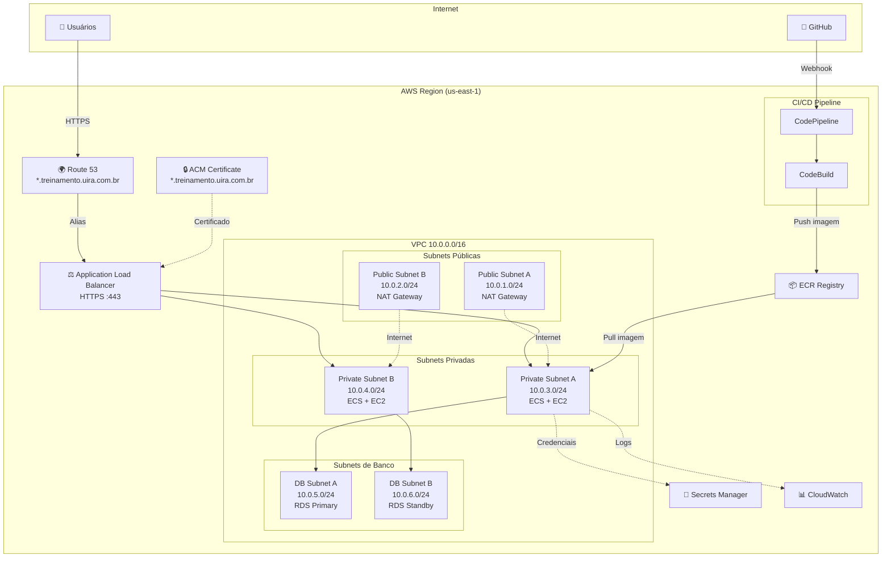
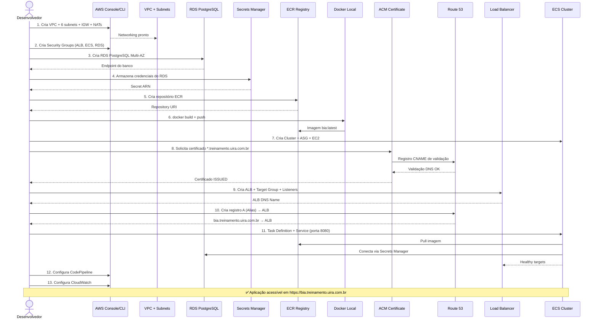

# 🚀 Guia Completo de Implantação AWS — Projeto BIA

> **Versão:** 4.2.0 | **Data:** 21/03/2026  
> **Domínio alvo:** `*.treinamento.uira.com.br`  
> **Região AWS:** `us-east-1`

---

## Índice

1. [Visão Geral da Infraestrutura](#1-visão-geral-da-infraestrutura)
2. [Função de Cada Serviço AWS](#2-função-de-cada-serviço-aws)
3. [Pré-requisitos](#3-pré-requisitos)
4. [Ordem de Implantação](#4-ordem-de-implantação)
5. [Etapa 1 — VPC e Networking](#5-etapa-1--vpc-e-networking)
6. [Etapa 2 — Security Groups](#6-etapa-2--security-groups)
7. [Etapa 3 — RDS PostgreSQL](#7-etapa-3--rds-postgresql)
8. [Etapa 4 — AWS Secrets Manager](#8-etapa-4--aws-secrets-manager)
9. [Etapa 5 — ECR (Registry de Imagens Docker)](#9-etapa-5--ecr-registry-de-imagens-docker)
10. [Etapa 6 — Build e Push da Imagem Docker](#10-etapa-6--build-e-push-da-imagem-docker)
11. [Etapa 7 — ECS Cluster com EC2](#11-etapa-7--ecs-cluster-com-ec2)
12. [Etapa 8 — ACM (Certificado SSL/TLS)](#12-etapa-8--acm-certificado-ssltls)
13. [Etapa 9 — Application Load Balancer (ALB)](#13-etapa-9--application-load-balancer-alb)
14. [Etapa 10 — Route 53 (DNS)](#14-etapa-10--route-53-dns)
15. [Etapa 11 — ECS Service + Task Definition](#15-etapa-11--ecs-service--task-definition)
16. [Etapa 12 — CI/CD com CodePipeline](#16-etapa-12--cicd-com-codepipeline)
17. [Etapa 13 — CloudWatch (Monitoramento)](#17-etapa-13--cloudwatch-monitoramento)
18. [Validação Final](#18-validação-final)
19. [Diagrama de Fluxo da Implantação](#19-diagrama-de-fluxo-da-implantação)
20. [Troubleshooting](#20-troubleshooting)

---

## 1. Visão Geral da Infraestrutura



---

## 2. Função de Cada Serviço AWS

| Serviço | Função no Projeto BIA |
|---|---|
| **VPC** | Rede virtual isolada que contém toda a infraestrutura. CIDR `10.0.0.0/16` com 6 subnets em 2 AZs. |
| **Subnets Públicas** | Hospedam os NAT Gateways e o ALB. Possuem rota para o Internet Gateway. |
| **Subnets Privadas** | Hospedam as instâncias EC2 do ECS Cluster. Sem acesso direto da internet — saem via NAT Gateway. |
| **Subnets de Banco** | Hospedam a instância RDS PostgreSQL (Primary + Standby Multi-AZ). Isoladas sem acesso à internet. |
| **NAT Gateway** | Permite que as subnets privadas (ECS) acessem a internet (para pull de imagens ECR, atualizações). Um em cada AZ para alta disponibilidade. |
| **Internet Gateway** | Ponto de entrada/saída de tráfego da VPC para a internet. Associado às subnets públicas. |
| **ALB (Application Load Balancer)** | Recebe tráfego HTTPS na porta 443, faz terminação SSL (com certificado ACM) e distribui para os containers ECS nas subnets privadas via Target Group (porta 8080). |
| **ACM (Certificate Manager)** | Gerencia o certificado SSL/TLS gratuito para `*.treinamento.uira.com.br`. Validação via DNS (Route 53). |
| **Route 53** | Serviço de DNS. Hospeda a zona `treinamento.uira.com.br` e aponta registros `A` (Alias) para o ALB. |
| **ECR (Elastic Container Registry)** | Registry privado Docker na AWS. Armazena as imagens da aplicação BIA (tag `latest` + hash do commit). |
| **ECS (Elastic Container Service)** | Orquestrador de containers. Gerencia o ciclo de vida dos containers BIA nas instâncias EC2, com rolling updates. |
| **EC2 (Auto Scaling Group)** | Instâncias `t3.micro` que executam o ECS Agent. O ASG mantém 2–4 instâncias ativas distribuídas entre as subnets privadas A e B. |
| **RDS PostgreSQL** | Banco de dados gerenciado (PostgreSQL 16). Multi-AZ com failover automático, backups automáticos e endpoint único de conexão. |
| **Secrets Manager** | Armazena as credenciais do RDS (username/password). A aplicação BIA lê via AWS SDK em runtime usando a variável `DB_SECRET_NAME`. |
| **CodePipeline** | Orquestra o pipeline CI/CD completo: Source (GitHub) → Build (CodeBuild) → Deploy (ECS). |
| **CodeBuild** | Executa o `buildspec.yml`: faz login no ECR, builda a imagem Docker, faz push, e gera `imagedefinitions.json` para o ECS. |
| **CloudWatch** | Coleta logs dos containers ECS, métricas de CPU/memória das instâncias EC2 e do RDS. Alarmetes de health check. |

---

## 3. Pré-requisitos

- [ ] Conta AWS ativa com permissões de administrador
- [ ] AWS CLI v2 instalado e configurado (`aws configure`)
- [ ] Docker Desktop instalado localmente
- [ ] Domínio `treinamento.uira.com.br` registrado (ou acesso ao DNS do domínio pai `uira.com.br`)
- [ ] Repositório GitHub com o código do projeto BIA
- [ ] Git instalado

```bash
# Verificar pré-requisitos
aws --version          # AWS CLI >= 2.x
docker --version       # Docker >= 20.x
aws sts get-caller-identity  # Confirmar credenciais
```

---

## 4. Ordem de Implantação

> **Regra:** cada etapa depende da anterior. Siga rigorosamente esta ordem.

```mermaid
graph LR
    A["1. VPC +<br/>Networking"] --> B["2. Security<br/>Groups"]
    B --> C["3. RDS<br/>PostgreSQL"]
    C --> D["4. Secrets<br/>Manager"]
    D --> E["5. ECR<br/>Registry"]
    E --> F["6. Build +<br/>Push Docker"]
    F --> G["7. ECS Cluster<br/>+ EC2 ASG"]
    G --> H["8. ACM<br/>Certificado"]
    H --> I["9. ALB +<br/>Target Group"]
    I --> J["10. Route 53<br/>DNS"]
    J --> K["11. ECS Service<br/>+ Task Def"]
    K --> L["12. CodePipeline<br/>CI/CD"]
    L --> M["13. CloudWatch<br/>Monitoramento"]

    style A fill:#4CAF50,color:white
    style H fill:#FF9500,color:white
    style J fill:#2196F3,color:white
    style L fill:#9C27B0,color:white
```



---

## 5. Etapa 1 — VPC e Networking

### 5.1 Criar a VPC

```bash
# Criar VPC
aws ec2 create-vpc \
  --cidr-block 10.0.0.0/16 \
  --tag-specifications 'ResourceType=vpc,Tags=[{Key=Name,Value=bia-vpc}]' \
  --region us-east-1
```

> Anote o `VpcId` retornado. Exemplo: `vpc-0abc123def456`

### 5.2 Habilitar DNS

```bash
aws ec2 modify-vpc-attribute --vpc-id <VPC_ID> --enable-dns-support
aws ec2 modify-vpc-attribute --vpc-id <VPC_ID> --enable-dns-hostnames
```

### 5.3 Criar Internet Gateway

```bash
aws ec2 create-internet-gateway \
  --tag-specifications 'ResourceType=internet-gateway,Tags=[{Key=Name,Value=bia-igw}]'

aws ec2 attach-internet-gateway --internet-gateway-id <IGW_ID> --vpc-id <VPC_ID>
```

### 5.4 Criar Subnets

| Subnet | CIDR | AZ | Tipo |
|---|---|---|---|
| Public A | 10.0.1.0/24 | us-east-1a | Pública (NAT Gateway + ALB) |
| Public B | 10.0.2.0/24 | us-east-1b | Pública (NAT Gateway + ALB) |
| Private A | 10.0.3.0/24 | us-east-1a | Privada (ECS/EC2) |
| Private B | 10.0.4.0/24 | us-east-1b | Privada (ECS/EC2) |
| DB A | 10.0.5.0/24 | us-east-1a | Privada (RDS Primary) |
| DB B | 10.0.6.0/24 | us-east-1b | Privada (RDS Standby) |

```bash
# Exemplo para Public Subnet A (repetir para cada subnet, alterando CIDR e AZ)
aws ec2 create-subnet \
  --vpc-id <VPC_ID> \
  --cidr-block 10.0.1.0/24 \
  --availability-zone us-east-1a \
  --tag-specifications 'ResourceType=subnet,Tags=[{Key=Name,Value=bia-public-a}]'
```

### 5.5 Criar NAT Gateways

```bash
# Alocar Elastic IP para NAT Gateway A
aws ec2 allocate-address --domain vpc
# Anote o AllocationId

# Criar NAT Gateway na Public Subnet A
aws ec2 create-nat-gateway \
  --subnet-id <PUBLIC_SUBNET_A_ID> \
  --allocation-id <EIP_ALLOC_ID> \
  --tag-specifications 'ResourceType=natgateway,Tags=[{Key=Name,Value=bia-nat-a}]'
```

> Repita para a Public Subnet B (segundo NAT Gateway para alta disponibilidade).

### 5.6 Criar Route Tables

```bash
# Route Table pública (IGW)
aws ec2 create-route-table --vpc-id <VPC_ID> \
  --tag-specifications 'ResourceType=route-table,Tags=[{Key=Name,Value=bia-public-rt}]'

aws ec2 create-route --route-table-id <PUBLIC_RT_ID> \
  --destination-cidr-block 0.0.0.0/0 --gateway-id <IGW_ID>

# Associar subnets públicas
aws ec2 associate-route-table --route-table-id <PUBLIC_RT_ID> --subnet-id <PUBLIC_SUBNET_A_ID>
aws ec2 associate-route-table --route-table-id <PUBLIC_RT_ID> --subnet-id <PUBLIC_SUBNET_B_ID>

# Route Table privada A (NAT Gateway A)
aws ec2 create-route-table --vpc-id <VPC_ID> \
  --tag-specifications 'ResourceType=route-table,Tags=[{Key=Name,Value=bia-private-a-rt}]'

aws ec2 create-route --route-table-id <PRIVATE_A_RT_ID> \
  --destination-cidr-block 0.0.0.0/0 --nat-gateway-id <NAT_GW_A_ID>

aws ec2 associate-route-table --route-table-id <PRIVATE_A_RT_ID> --subnet-id <PRIVATE_SUBNET_A_ID>

# Repetir para Private Subnet B com NAT Gateway B
```

---

## 6. Etapa 2 — Security Groups

```bash
# SG do ALB — aceita HTTPS da internet
aws ec2 create-security-group \
  --group-name bia-alb-sg \
  --description "ALB - HTTPS ingress" \
  --vpc-id <VPC_ID>

aws ec2 authorize-security-group-ingress --group-id <ALB_SG_ID> \
  --protocol tcp --port 443 --cidr 0.0.0.0/0

aws ec2 authorize-security-group-ingress --group-id <ALB_SG_ID> \
  --protocol tcp --port 80 --cidr 0.0.0.0/0

# SG do ECS/EC2 — aceita tráfego do ALB na porta 8080
aws ec2 create-security-group \
  --group-name bia-ecs-sg \
  --description "ECS containers - porta 8080 do ALB" \
  --vpc-id <VPC_ID>

aws ec2 authorize-security-group-ingress --group-id <ECS_SG_ID> \
  --protocol tcp --port 8080 --source-group <ALB_SG_ID>

# SG do RDS — aceita PostgreSQL (5432) do ECS
aws ec2 create-security-group \
  --group-name bia-rds-sg \
  --description "RDS PostgreSQL - porta 5432 do ECS" \
  --vpc-id <VPC_ID>

aws ec2 authorize-security-group-ingress --group-id <RDS_SG_ID> \
  --protocol tcp --port 5432 --source-group <ECS_SG_ID>
```

---

## 7. Etapa 3 — RDS PostgreSQL

### 7.1 Criar DB Subnet Group

```bash
aws rds create-db-subnet-group \
  --db-subnet-group-name bia-db-subnet-group \
  --db-subnet-group-description "Subnets para RDS BIA" \
  --subnet-ids <DB_SUBNET_A_ID> <DB_SUBNET_B_ID>
```

### 7.2 Criar Instância RDS

```bash
aws rds create-db-instance \
  --db-instance-identifier bia-postgres \
  --db-instance-class db.t3.micro \
  --engine postgres \
  --engine-version 16 \
  --master-username postgres \
  --master-user-password "<SENHA_FORTE>" \
  --allocated-storage 20 \
  --db-name bia \
  --vpc-security-group-ids <RDS_SG_ID> \
  --db-subnet-group-name bia-db-subnet-group \
  --multi-az \
  --backup-retention-period 7 \
  --storage-encrypted \
  --no-publicly-accessible \
  --tags Key=Name,Value=bia-postgres
```

> ⏳ Aguarde ~10 min até o status `available`:
> ```bash
> aws rds wait db-instance-available --db-instance-identifier bia-postgres
> aws rds describe-db-instances --db-instance-identifier bia-postgres \
>   --query 'DBInstances[0].Endpoint'
> ```
> Anote o **Endpoint.Address** (ex: `bia-postgres.xxxx.us-east-1.rds.amazonaws.com`)

---

## 8. Etapa 4 — AWS Secrets Manager

Armazena as credenciais do RDS para a aplicação BIA ler via `DB_SECRET_NAME`.

```bash
aws secretsmanager create-secret \
  --name bia/database/credentials \
  --description "Credenciais do RDS PostgreSQL para o projeto BIA" \
  --secret-string '{
    "username": "postgres",
    "password": "<MESMA_SENHA_DO_RDS>",
    "host": "bia-postgres.xxxx.us-east-1.rds.amazonaws.com",
    "port": 5432,
    "dbname": "bia"
  }' \
  --region us-east-1
```

---

## 9. Etapa 5 — ECR (Registry de Imagens Docker)

```bash
aws ecr create-repository \
  --repository-name bia \
  --image-scanning-configuration scanOnPush=true \
  --region us-east-1
```

> Anote o `repositoryUri` (ex: `380278406175.dkr.ecr.us-east-1.amazonaws.com/bia`)

---

## 10. Etapa 6 — Build e Push da Imagem Docker

Esta etapa mostra como **publicar manualmente** a imagem Docker. Depois, o CodePipeline fará isso automaticamente.

### 10.1 Login no ECR

```bash
aws ecr get-login-password --region us-east-1 | \
  docker login --username AWS --password-stdin \
  380278406175.dkr.ecr.us-east-1.amazonaws.com
```

### 10.2 Build da Imagem

O `Dockerfile` do projeto já faz tudo automaticamente:
1. Instala dependências Node.js (raiz + client)
2. Executa `vite build` no front-end React
3. Faz prune de devDependencies
4. Expõe porta 8080 e roda `npm start` (Express)

```bash
# Na raiz do projeto BIA
docker build -t bia:latest .
```

### 10.3 Tag e Push para ECR

```bash
# Tag
docker tag bia:latest 380278406175.dkr.ecr.us-east-1.amazonaws.com/bia:latest

# Push
docker push 380278406175.dkr.ecr.us-east-1.amazonaws.com/bia:latest
```

### 10.4 Verificar imagem no ECR

```bash
aws ecr describe-images --repository-name bia --region us-east-1
```

---

## 11. Etapa 7 — ECS Cluster com EC2

### 11.1 Criar Cluster ECS

```bash
aws ecs create-cluster --cluster-name bia-cluster --region us-east-1
```

### 11.2 Criar IAM Role para EC2 (ECS Instance Role)

```bash
# Criar role
aws iam create-role \
  --role-name ecsInstanceRole \
  --assume-role-policy-document '{
    "Version":"2012-10-17",
    "Statement":[{
      "Effect":"Allow",
      "Principal":{"Service":"ec2.amazonaws.com"},
      "Action":"sts:AssumeRole"
    }]
  }'

# Anexar policies necessárias
aws iam attach-role-policy --role-name ecsInstanceRole \
  --policy-arn arn:aws:iam::aws:policy/service-role/AmazonEC2ContainerServiceforEC2Role
aws iam attach-role-policy --role-name ecsInstanceRole \
  --policy-arn arn:aws:iam::aws:policy/SecretsManagerReadWrite

# Criar Instance Profile
aws iam create-instance-profile --instance-profile-name ecsInstanceProfile
aws iam add-role-to-instance-profile \
  --instance-profile-name ecsInstanceProfile --role-name ecsInstanceRole
```

### 11.3 Criar Launch Template para EC2

```bash
aws ec2 create-launch-template \
  --launch-template-name bia-ecs-lt \
  --launch-template-data '{
    "ImageId": "ami-0f7b55661ecbbe44c",
    "InstanceType": "t3.micro",
    "IamInstanceProfile": {"Name": "ecsInstanceProfile"},
    "SecurityGroupIds": ["<ECS_SG_ID>"],
    "UserData": "'$(echo '#!/bin/bash
echo ECS_CLUSTER=bia-cluster >> /etc/ecs/ecs.config' | base64)'"
  }'
```

> **Nota:** `ami-0f7b55661ecbbe44c` é a AMI ECS-Optimized para `us-east-1`. Verifique a mais recente com:
> ```bash
> aws ssm get-parameters --names /aws/service/ecs/optimized-ami/amazon-linux-2/recommended/image_id --region us-east-1 --query 'Parameters[0].Value' --output text
> ```

### 11.4 Criar Auto Scaling Group

```bash
aws autoscaling create-auto-scaling-group \
  --auto-scaling-group-name bia-ecs-asg \
  --launch-template LaunchTemplateName=bia-ecs-lt,Version='$Latest' \
  --min-size 2 \
  --max-size 4 \
  --desired-capacity 2 \
  --vpc-zone-identifier "<PRIVATE_SUBNET_A_ID>,<PRIVATE_SUBNET_B_ID>" \
  --tags Key=Name,Value=bia-ecs-instance,PropagateAtLaunch=true
```

---

## 12. Etapa 8 — ACM (Certificado SSL/TLS)

### 12.1 Solicitar Certificado Wildcard

```bash
aws acm request-certificate \
  --domain-name "*.treinamento.uira.com.br" \
  --subject-alternative-names "treinamento.uira.com.br" \
  --validation-method DNS \
  --region us-east-1
```

> Anote o `CertificateArn` retornado.

### 12.2 Obter Registro DNS de Validação

```bash
aws acm describe-certificate \
  --certificate-arn <CERTIFICATE_ARN> \
  --query 'Certificate.DomainValidationOptions[0].ResourceRecord' \
  --region us-east-1
```

> Retorna algo como:
> ```json
> { "Name": "_abcdef.treinamento.uira.com.br.", "Type": "CNAME", "Value": "_xyz.acm-validations.aws." }
> ```

### 12.3 Criar Registro DNS de Validação no Route 53

```bash
# Obter a Hosted Zone do domínio pai (uira.com.br) ou criar uma para treinamento.uira.com.br
aws route53 list-hosted-zones-by-name --dns-name uira.com.br

# Criar o registro CNAME de validação
aws route53 change-resource-record-sets \
  --hosted-zone-id <HOSTED_ZONE_ID> \
  --change-batch '{
    "Changes": [{
      "Action": "CREATE",
      "ResourceRecordSet": {
        "Name": "_abcdef.treinamento.uira.com.br",
        "Type": "CNAME",
        "TTL": 300,
        "ResourceRecords": [{"Value": "_xyz.acm-validations.aws."}]
      }
    }]
  }'
```

### 12.4 Aguardar Validação

```bash
aws acm wait certificate-validated --certificate-arn <CERTIFICATE_ARN> --region us-east-1
```

> ⏳ A validação DNS pode levar de 5 a 30 minutos.

---

## 13. Etapa 9 — Application Load Balancer (ALB)

### 13.1 Criar ALB

```bash
aws elbv2 create-load-balancer \
  --name bia-alb \
  --subnets <PUBLIC_SUBNET_A_ID> <PUBLIC_SUBNET_B_ID> \
  --security-groups <ALB_SG_ID> \
  --scheme internet-facing \
  --type application \
  --ip-address-type ipv4
```

> Anote o `LoadBalancerArn` e o `DNSName`.

### 13.2 Criar Target Group

```bash
aws elbv2 create-target-group \
  --name bia-tg \
  --protocol HTTP \
  --port 8080 \
  --vpc-id <VPC_ID> \
  --target-type instance \
  --health-check-protocol HTTP \
  --health-check-path /api/versao \
  --health-check-interval-seconds 30 \
  --healthy-threshold-count 2 \
  --unhealthy-threshold-count 3
```

### 13.3 Criar Listener HTTPS (porta 443)

```bash
aws elbv2 create-listener \
  --load-balancer-arn <ALB_ARN> \
  --protocol HTTPS \
  --port 443 \
  --certificates CertificateArn=<CERTIFICATE_ARN> \
  --default-actions Type=forward,TargetGroupArn=<TARGET_GROUP_ARN> \
  --ssl-policy ELBSecurityPolicy-TLS13-1-2-2021-06
```

### 13.4 Criar Listener HTTP (redirect para HTTPS)

```bash
aws elbv2 create-listener \
  --load-balancer-arn <ALB_ARN> \
  --protocol HTTP \
  --port 80 \
  --default-actions Type=redirect,RedirectConfig='{
    "Protocol":"HTTPS","Port":"443","StatusCode":"HTTP_301"
  }'
```

---

## 14. Etapa 10 — Route 53 (DNS)

### 14.1 Criar Hosted Zone (se não existir)

Se o domínio `treinamento.uira.com.br` ainda não possui uma Hosted Zone dedicada:

```bash
aws route53 create-hosted-zone \
  --name treinamento.uira.com.br \
  --caller-reference "bia-$(date +%s)"
```

> Se usar Hosted Zone separada, lembre-se de configurar os **NS records** no domínio pai (`uira.com.br`) apontando para os nameservers retornados.

### 14.2 Registrar o Domínio da Aplicação (Alias para ALB)

```bash
# Obtenha o HostedZoneId do ALB (específico do serviço ELB)
# Para us-east-1 o HostedZoneId do ALB é: Z35SXDOTRQ7X7K

aws route53 change-resource-record-sets \
  --hosted-zone-id <HOSTED_ZONE_ID_TREINAMENTO> \
  --change-batch '{
    "Changes": [{
      "Action": "CREATE",
      "ResourceRecordSet": {
        "Name": "bia.treinamento.uira.com.br",
        "Type": "A",
        "AliasTarget": {
          "HostedZoneId": "Z35SXDOTRQ7X7K",
          "DNSName": "<ALB_DNS_NAME>",
          "EvaluateTargetHealth": true
        }
      }
    }]
  }'
```

> Para outros subdomínios (ex: `api.treinamento.uira.com.br`), repita o mesmo comando alterando o `Name`.

### 14.3 Verificar resolução DNS

```bash
nslookup bia.treinamento.uira.com.br
# Deve resolver para os IPs do ALB
```

---

## 15. Etapa 11 — ECS Service + Task Definition

### 15.1 Criar IAM Role para Tasks (ecsTaskExecutionRole)

```bash
aws iam create-role \
  --role-name ecsTaskExecutionRole \
  --assume-role-policy-document '{
    "Version":"2012-10-17",
    "Statement":[{
      "Effect":"Allow",
      "Principal":{"Service":"ecs-tasks.amazonaws.com"},
      "Action":"sts:AssumeRole"
    }]
  }'

aws iam attach-role-policy --role-name ecsTaskExecutionRole \
  --policy-arn arn:aws:iam::aws:policy/service-role/AmazonECSTaskExecutionRolePolicy
aws iam attach-role-policy --role-name ecsTaskExecutionRole \
  --policy-arn arn:aws:iam::aws:policy/SecretsManagerReadWrite
```

### 15.2 Registrar Task Definition

Crie o arquivo `bia-task-def.json`:

```json
{
  "family": "bia",
  "networkMode": "bridge",
  "executionRoleArn": "arn:aws:iam::<ACCOUNT_ID>:role/ecsTaskExecutionRole",
  "taskRoleArn": "arn:aws:iam::<ACCOUNT_ID>:role/ecsTaskExecutionRole",
  "containerDefinitions": [
    {
      "name": "bia",
      "image": "<ACCOUNT_ID>.dkr.ecr.us-east-1.amazonaws.com/bia:latest",
      "cpu": 256,
      "memory": 512,
      "essential": true,
      "portMappings": [
        {
          "containerPort": 8080,
          "hostPort": 0,
          "protocol": "tcp"
        }
      ],
      "environment": [
        { "name": "DB_HOST", "value": "<RDS_ENDPOINT>" },
        { "name": "DB_PORT", "value": "5432" },
        { "name": "DB_SECRET_NAME", "value": "bia/database/credentials" },
        { "name": "DB_REGION", "value": "us-east-1" },
        { "name": "VERSAO_API", "value": "4.2.0" }
      ],
      "logConfiguration": {
        "logDriver": "awslogs",
        "options": {
          "awslogs-group": "/ecs/bia",
          "awslogs-region": "us-east-1",
          "awslogs-stream-prefix": "bia"
        }
      }
    }
  ]
}
```

```bash
# Criar Log Group
aws logs create-log-group --log-group-name /ecs/bia --region us-east-1

# Registrar Task Definition
aws ecs register-task-definition --cli-input-json file://bia-task-def.json
```

### 15.3 Criar ECS Service

```bash
aws ecs create-service \
  --cluster bia-cluster \
  --service-name bia-service \
  --task-definition bia \
  --desired-count 2 \
  --launch-type EC2 \
  --load-balancers targetGroupArn=<TARGET_GROUP_ARN>,containerName=bia,containerPort=8080 \
  --role arn:aws:iam::<ACCOUNT_ID>:role/aws-service-role/ecs.amazonaws.com/AWSServiceRoleForECS \
  --deployment-configuration maximumPercent=200,minimumHealthyPercent=50
```

### 15.4 Executar Migrations do Banco

Após o serviço estiver rodando e conectar ao RDS, execute a migration:

```bash
# Via SSH na instância EC2 ou via ECS Exec
aws ecs execute-command \
  --cluster bia-cluster \
  --task <TASK_ID> \
  --container bia \
  --interactive \
  --command "npx sequelize-cli db:migrate"
```

---

## 16. Etapa 12 — CI/CD com CodePipeline

### 16.1 Criar CodeBuild Project

O projeto já possui o `buildspec.yml`. Crie o projeto CodeBuild:

```bash
aws codebuild create-project \
  --name bia-build \
  --source type=GITHUB,location=https://github.com/henrylle/bia.git \
  --artifacts type=NO_ARTIFACTS \
  --environment type=LINUX_CONTAINER,computeType=BUILD_GENERAL1_SMALL,image=aws/codebuild/amazonlinux2-x86_64-standard:5.0,privilegedMode=true \
  --service-role arn:aws:iam::<ACCOUNT_ID>:role/codebuild-service-role
```

### 16.2 Criar CodePipeline

```bash
aws codepipeline create-pipeline --pipeline '{
  "name": "bia-pipeline",
  "roleArn": "arn:aws:iam::<ACCOUNT_ID>:role/codepipeline-service-role",
  "stages": [
    {
      "name": "Source",
      "actions": [{
        "name": "GitHub",
        "actionTypeId": {"category":"Source","owner":"ThirdParty","provider":"GitHub","version":"1"},
        "configuration": {
          "Owner": "henrylle",
          "Repo": "bia",
          "Branch": "main",
          "OAuthToken": "<GITHUB_TOKEN>"
        },
        "outputArtifacts": [{"name": "SourceOutput"}]
      }]
    },
    {
      "name": "Build",
      "actions": [{
        "name": "DockerBuild",
        "actionTypeId": {"category":"Build","owner":"AWS","provider":"CodeBuild","version":"1"},
        "configuration": {"ProjectName": "bia-build"},
        "inputArtifacts": [{"name": "SourceOutput"}],
        "outputArtifacts": [{"name": "BuildOutput"}]
      }]
    },
    {
      "name": "Deploy",
      "actions": [{
        "name": "ECS-Deploy",
        "actionTypeId": {"category":"Deploy","owner":"AWS","provider":"ECS","version":"1"},
        "configuration": {
          "ClusterName": "bia-cluster",
          "ServiceName": "bia-service",
          "FileName": "imagedefinitions.json"
        },
        "inputArtifacts": [{"name": "BuildOutput"}]
      }]
    }
  ]
}'
```

**Fluxo automatizado resultante:**
```
git push → GitHub Webhook → CodePipeline → CodeBuild (docker build + push ECR) → ECS (rolling update)
```

---

## 17. Etapa 13 — CloudWatch (Monitoramento)

### 17.1 Verificar Logs

```bash
# Ver logs do container
aws logs tail /ecs/bia --follow --region us-east-1
```

### 17.2 Criar Alarme de CPU

```bash
aws cloudwatch put-metric-alarm \
  --alarm-name bia-high-cpu \
  --metric-name CPUUtilization \
  --namespace AWS/ECS \
  --statistic Average \
  --period 300 \
  --threshold 80 \
  --comparison-operator GreaterThanThreshold \
  --evaluation-periods 2 \
  --dimensions Name=ClusterName,Value=bia-cluster Name=ServiceName,Value=bia-service \
  --alarm-actions <SNS_TOPIC_ARN>
```

---

## 18. Validação Final

Execute esta checklist após completar todas as etapas:

| # | Validação | Comando / Ação |
|---|---|---|
| 1 | Certificado ACM validado | `aws acm describe-certificate --certificate-arn <ARN> --query Certificate.Status` → `ISSUED` |
| 2 | ALB com listener HTTPS | `aws elbv2 describe-listeners --load-balancer-arn <ALB_ARN>` |
| 3 | DNS resolve para ALB | `nslookup bia.treinamento.uira.com.br` |
| 4 | HTTPS funcional | `curl -I https://bia.treinamento.uira.com.br/api/versao` → `200 OK` |
| 5 | Redirect HTTP→HTTPS | `curl -I http://bia.treinamento.uira.com.br` → `301 → https://...` |
| 6 | ECS tasks saudáveis | `aws ecs describe-services --cluster bia-cluster --services bia-service --query 'services[0].runningCount'` |
| 7 | RDS acessível pelo ECS | Verifica logs: `aws logs tail /ecs/bia` (sem erros de conexão) |
| 8 | API respondendo | `curl https://bia.treinamento.uira.com.br/api/tarefas` → `[]` |
| 9 | Front-end carregando | Abrir `https://bia.treinamento.uira.com.br` no navegador |
| 10 | CI/CD funcional | `git push` → verificar pipeline: `aws codepipeline get-pipeline-state --name bia-pipeline` |

---

## 19. Diagrama de Fluxo da Implantação



---

## 20. Troubleshooting

| Problema | Causa Provável | Solução |
|---|---|---|
| Container não inicia | Imagem não encontrada no ECR | Verificar `docker push` e repositório URI na Task Definition |
| ECS task `STOPPED` | Erro de conexão com RDS | Verificar SG do RDS permite porta 5432 do SG do ECS |
| `502 Bad Gateway` no ALB | Container não está healthy | Verificar Health Check path (`/api/versao`) e porta (8080) |
| Certificado `PENDING_VALIDATION` | CNAME de validação não criado/propagado | Verificar registro CNAME no Route 53 e aguardar propagação |
| DNS não resolve | NS do domínio pai não configurados | Adicionar registros NS da hosted zone `treinamento.uira.com.br` no domínio pai `uira.com.br` |
| `UNABLE_TO_PULL_SECRETS` | Task Role sem permissão | Adicionar policy `SecretsManagerReadWrite` à `ecsTaskExecutionRole` |
| Nenhum container registrado no Target Group | ECS Service sem ALB configurado | Recriar service com `--load-balancers` ou corrigir `hostPort` na Task Definition |
